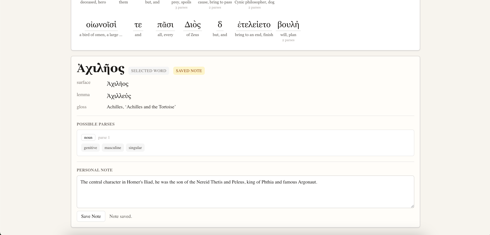
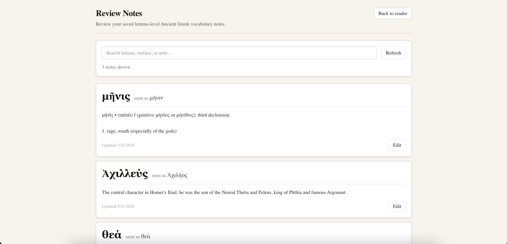

# Ancient Greek Interlinear Reader

A full-stack Ancient Greek reading and study tool that turns pasted Greek passages into interlinear vocabulary, lemmas, morphology, and clickable word-level analysis.

I built this project after noticing that Ancient Greek learners often have to jump between a text, a dictionary, and a morphology tool just to understand a passage. This app brings those steps into one interface: paste a passage, parse the words, inspect possible morphological analyses, save passages, and create lemma-level vocabulary notes for review.

The project was inspired by NoDictionaries, but adapted for Ancient Greek.

## Live Demo

Live Site: **https://interlinear-ancient-greek.vercel.app/**

## Features

### Reading and Parsing
- Paste Ancient Greek passages and preserve original line breaks
- Parse word forms using a Dockerized Morpheus / Perseids morphology API
- Click words to inspect lemma, gloss, part of speech, and possible morphology
- Use LSJ-based lexical data for short English glosses

### Greek-Specific Fallback Handling

- Clean and normalize copied Greek text before parsing
- Handle common particles and elided forms
- Add curated Homeric gloss overrides for poetic or difficult forms

### User Study Tools
- Sign in with GitHub
- Save, load, update, and delete personal passages
- Save personal notes by lemma, so notes apply across inflected forms
- Review and edit saved vocabulary notes
- Display note indicators on words with saved notes

## Tech Stack

**Frontend**
- Next.js
- React
- Tailwind CSS

**Backend**
- Next.js API routes
- Prisma ORM
- Neon PostgreSQL
- Auth.js / NextAuth

**Language Processing**
- Morpheus / Perseids morphology API
- LSJ-based Greek-English dictionary data
- Custom Greek normalization and fallback handling

**Deployment**
- Vercel for the Next.js application
- Fly.io for the Dockerized Morpheus API
- Neon for hosted PostgreSQL

## Screenshots

### Reader View

### Word Analysis Panel

### Review Notes Page

## Current Limitations

- Glosses are automatically selected and may sometimes be broad or poorly ranked.
- Homeric and poetic forms may require curated overrides.
- Morpheus can return multiple valid parses for ambiguous Greek forms.
- The app does not yet perform full contextual disambiguation.

